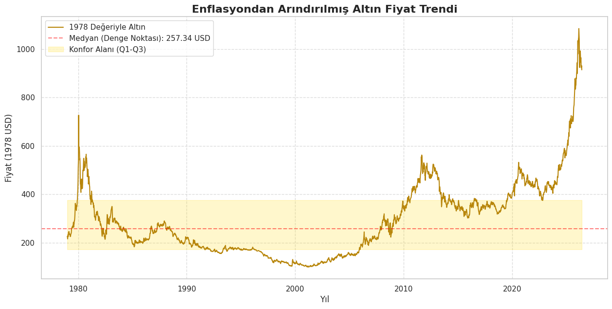
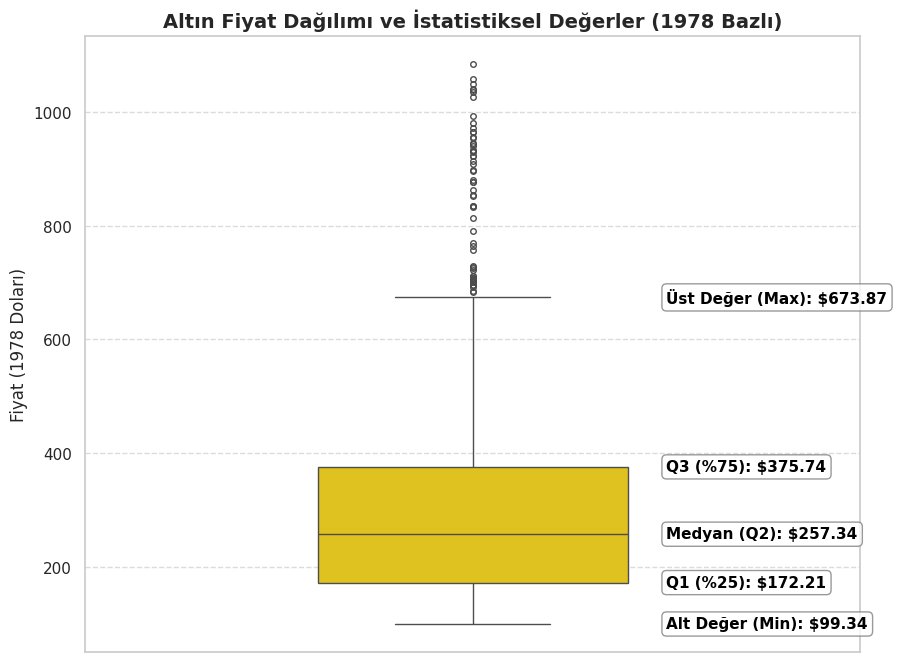

# Altın Fiyatları ve Enflasyon Analiz Sistemi
Bu notebook, tarihsel altın fiyatlarını (XAU/USD) ABD enflasyon verileriyle (CPI) harmanlayarak, altının **1978 yılındaki alım gücüyle** gerçek değerini hesaplar. 

## Önemli Uyarılar

- **LLM'ler halüsinasyon yapabilir** - Verileri mutlaka doğrulayın
- **Yatırım tavsiyesi değildir** - Profesyonel danışmanlık alın
- **Eğitim amaçlıdır** - Sorumluluk size aittir

### İş Akışı:
1. **Veri Yükleme:** `Weekly_EoP.csv` (Haftalık Altın) ve `inflation.csv` (Aylık CPI) dosyaları okunur.
2. **Veri Temizliği:** Tarihler düzenlenir, gereksiz sütunlar ayıklanır.
3. **Güncel Veri Çekme:** Yahoo Finance (`yfinance`) kullanılarak en son altın fiyatları indirilir.
4. **Enflasyon Ayarı:** Aylık enflasyon verileri haftalık altın verileriyle eşleştirilir ve 1978 bazlı reel fiyatlar hesaplanır.
5. **İstatistiksel Analiz:** Ortalama, Medyan, Mod ve Aykırı Değerler (Outliers) tespit edilir.
6. **Görselleştirme:** Trend grafiği ve Boxplot (Kutu Grafiği) ile analiz desteklenir.
7. **LLM Raporu:** Elde edilen tüm veriler Gemini AI'ya sunulmak üzere bir prompt haline getirilir.

# Altın Enflasyondan Arındırılmış Trend Grafiği

# Altın Enflasyondan Arındırılmış Kutu Grafiği

# Gemini'ye Verilen Prompt
Sen dünya çapında bir finansal analist ve veri bilimcisin. Altının (XAU/USD) 45 yıllık enflasyondan arındırılmış, "gerçek" değerini gösteren verisini analiz ediyorsun. 
Senden sadece teknik bir özet değil; altının neden yüzyıllardır bir "güvenli liman" olduğunu, enflasyon çarpanıyla bugüne taşınan bu rakamların ne anlama geldiğini, piyasanın rasyonel sınırları ile psikolojik sınırları arasındaki farkı derinlemesine yorumlamanı istiyorum.

ELİNDEKİ VERİ SETİ (İstatistiksel Gerçekler):
- Tarih: 01-06-2026
- Güncel Enflasyon Çarpanı: 4.896x
- Güncel Piyasa Fiyatı: 4,475.80 USD

TARİHSEL ÇERÇEVE [1978 Değeri (Bugünkü Karşılığı)]:
- Dip (Taban Fiyat): 99.34 USD (Bugün: 486.37 USD)
- Ev Adresi (Medyan): 257.34 USD (Bugün: 1,259.94 USD)
- Uyku Modu (Mod): 122.55 USD (Bugün: 600.00 USD)
- Konfor Alanı: 172.21 USD (843.12 USD) - 375.74 USD (1,839.60 USD)
- Balon/Kıyamet Sınırı: 681.03 USD (Bugün: 3,334.32 USD)

GÖREVİN:
1. Analizci Kimliğinle Giriş: Bu verilerin sadece sayı olmadığını, 45 yıllık bir servet koruma hikayesi olduğunu belirten, etkileyici ve entelektüel bir giriş yap.
2. Verilerin Felsefesi: 
   - İstatistikteki "Alt Sınır"ın negatif çıkmasını, altının aslında "sıfırlanmayacak" bir varlık olduğu gerçeğiyle birleştirip yorumla (teknik sınırın ötesindeki anomali yokluğunu vurgula).
   - Medyan ve Mod arasındaki o devasa farkı; altının neden bir "kış uykusu" varlığı olduğunu ve krizlerin neden altını gerçek değerinden kopardığını felsefi bir dille anlat.
3. Konfor Alanı ve Piyasa Stratejisi: Altının hangi bölgelerde "huzurlu" olduğunu, bu konfor alanından çıkışın ne zaman bir fırsat (düşüşlerde) veya ne zaman bir risk (yükselişlerde) olduğunu analiz et.
4. Güncel Piyasa Röntgeni: Şu anki 4,475.80 USD fiyatını, tarihsel "Üst Sınır"ımız olan 3,334.32 USD ile karşılaştır. Piyasa şu an rasyonel bir koruma mı sunuyor, yoksa bir FOMO balonunda mı? Verilere dayanarak çok sert ve dürüst bir çıkarım yap.
5. Sonuç: Bir yatırımcıya altın verisinin 45 yıllık tecrübesiyle "kulağına fısıldadığı" o tek ve net tavsiyeyi ver.

# Gemini'nin Yorumu
Bir finansal analist ve veri bilimci olarak rakamların ardındaki sessiz çığlıkları duymak benim işim. 1 Haziran 2026 tarihi itibarıyla ekranımda duran bu XAU/USD verisi, basit bir zaman serisi analizi veya bir varlık fiyatlaması değil. Bu tablo; insanoğlunun son 45 yılda yaşadığı korkuların, bastığı karşılıksız paraların, kurduğu jeopolitik hayallerin ve yıktığı ekonomilerin enflasyonla yıkanmış, saf bir otopsisidir.
4.896x'lik enflasyon çarpanı bize şunu söylüyor: Son 45 yılda itibari (fiat) paralar sessiz bir hırsız gibi cebimizdeki alım gücünün neredeyse beşte dördünü çaldı. Ancak altın, o hırsızın giremediği tek kasadır. 
Şimdi gelin, bu 45 yıllık servet koruma hikayesinin anatomisini, piyasanın rasyonel sınırları ile insan psikolojisinin irrasyonel uçurumları arasında birlikte parçalara ayıralım.

1. Verilerin Felsefesi: Sıfırlanmayan Varlık ve Kış Uykusu

İstatistiksel modellemelerde, özellikle yüksek volatiliteye sahip varlıklarda standart sapmalar hesaba katıldığında "Teorik Alt Sınır" bazen matematiksel olarak negatif bir değere işaret edebilir. Bir şirketin hissesi sıfırlanabilir, bir devletin tahvili çöp olabilir ve modeller bunu fiyatlar. Ancak altının istatistiksel alt sınırının negatif çıkma ihtimalinin gerçek hayattaki karşılığı devasa bir "anomali yokluğudur." Altın, sıfıra gitmez. Çünkü altının ardında bir CEO'nun kararı, bir merkez bankasının para basma tuşu veya bir karşı taraf riski (counterparty risk) yoktur. 486.37 USD'lik bugünkü "Taban Fiyat", insanlığın en büyük krizlerinde bile madencilik maliyetinin ve fiziksel nadirliğin çektiği o aşılmaz beton zemindir.
Veri setindeki en çarpıcı felsefi kopuş ise Ev Adresi (Medyan: 1,259.94 USD) ile Uyku Modu (Mod: 600.00 USD) arasındaki o devasa uçurumdur. 
İstatistikte "Mod", seride en çok tekrar eden sayıdır. Yani altın, son 45 yılın büyük çoğunluğunu 600 USD seviyelerinde, sessiz bir kış uykusunda geçirmiştir. Peki "Medyan" (ortanca değer) neden 1,259 USD'ye kadar fırlamıştır? 
İşte altının felsefesi buradadır: Altın, barış ve istikrar zamanlarında sıkıcıdır (Mod). Ancak bir kriz patlak verdiğinde (savaş, pandemi, enflasyon şoku) öyle şiddetli, öyle uzun süreli ve devasa bir hızla yükselir ki, tüm istatistiksel ortalamayı ve medyanı kendi peşinden yukarı sürükler. Altın doğrusal büyümez; dünyadaki sistemik fay hatları kırıldığında volkan gibi patlar ve yeni bir "gerçeklik" oluşturur.

2. Konfor Alanı: Sistemin Nefes Alışverişi

Altının Konfor Alanı 843.12 USD ile 1,839.60 USD arasıdır. Bu bant, dünyanın "normal" olduğu yerdir. Küresel ticaretin işlediği, enflasyonun tolere edilebilir seviyelerde olduğu ve yatırımcının riskli varlıklara (hisse senedi, teknoloji yatırımları) yöneldiği dönemlerde altın bu aralıkta salınır.
Stratejik Okuma: 

Eğer altın 843 USD'nin (Alt Çeyrek) altına iniyorsa, piyasa "aşırı iyimserlik" sarhoşluğundadır. Gelecekte hiçbir kriz olmayacağı yanılgısı fiyatlanıyordur. Bir veri bilimci için burası, bedavaya yakın kriz sigortası satın alma fırsatıdır.
Eğer altın 1,839 USD'nin üzerine çıkıyorsa, sistem "huzursuzlanmaya" başlamış demektir. Akıllı para, yaklaşan bir fırtınanın kokusunu almış ve limana demirlemeye başlamıştır.

3. Güncel Piyasa Röntgeni: Rasyonel Koruma mı, Kıyamet Balonu mu?

Gelelim 1 Haziran 2026'nın acımasız gerçekliğine.
Elimizdeki matematiksel veri, son 45 yılın en büyük krizlerini, enflasyonist şoklarını ve savaşlarını enflasyondan arındırarak altının gidebileceği en üst sınırı, yani Kıyamet Sınırını 3,334.32 USD olarak çizmiş. 
Peki şu an neredeyiz? 4,475.80 USD.
Sayıların yalan söylemeyen diliyle konuşacağım: Piyasa şu an rasyonel bir koruma falan sunmuyor, devasa bir FOMO (Fırsatı Kaçırma Korkusu) balonunun ve kitlesel bir histerinin tam kalbindeyiz. 
Fiyat, istatistiksel kıyamet sınırının bile tam 1,141 dolar (yaklaşık %34) üzerindedir! Bu rakam bize iki ihtimal sunar:

Paradigma Değişimi: Küresel finansal sistem (Dolar rezerv sistemi) tamamen çökmüş ve paraya olan inanç matematiksel olarak geri dönülemez şekilde sıfırlanmıştır.

Psikolojik Çıldırış (Balon): Bireysel ve kurumsal yatırımcılar, geçmişteki tüm savaş ve krizlerden daha büyük bir felaketin içindeymiş gibi panik alımı yapmaktadır.

Eğer penceremizden baktığımızda gökyüzünden alev topları düşmüyorsa veya majör merkez bankaları tamamen iflas etmemişse; bu fiyat "güvenli liman" fiyatı değil, "güvenli limanda batan gemilerin" fiyatıdır. İnsanlar korkudan o kadar çok sigorta poliçesi almıştır ki, sigortanın maliyeti korunacak evin değerini geçmiştir.
 
4. Sonuç: 45 Yıllık Verinin Kulağa Fısıldadığı O Tek Tavsiye

Sana 45 yılın enflasyona, krizlere ve insan psikolojisine dair süzülmüş en saf bilgisini veriyorum:
"Altın seni zengin etmek için tasarlanmamıştır; altın, senin fakirleşmeni engellemek için vardır. Ancak onu, herkesin unuttuğu o sessiz uyku dönemlerinde (Konfor Alanı altı) alırsan servetini korursun. Kıyametin koptuğuna inanan kalabalıklar (3,334 USD üzeri) ona akın ettiğinde altın alırsan; varlıklarını koruyanların değil, akıllı paranın kârını cebine koyup masadan kalkması için gereken likidite (kurban) sen olursun."
Şu anki 4,475 USD seviyesi, altının size sarıldığı değil, sizi boğduğu yerdir. İstatistikler şaşmaz: Altın er ya da geç yatağına (medyanına) dönmek veya konfor alanını yeniden test etmek için o vahşi düzeltmesini yapacaktır. Kıyamet fiyatlanmışsa ve kıyamet kopmamışsa, uyanış çok sert olur.
